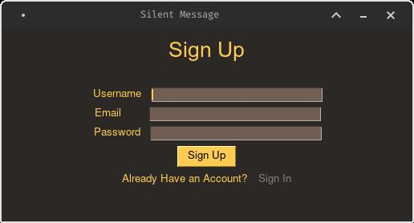
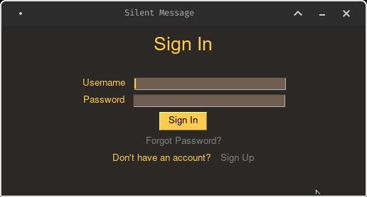
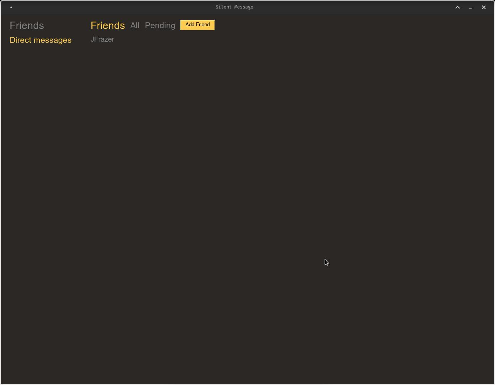
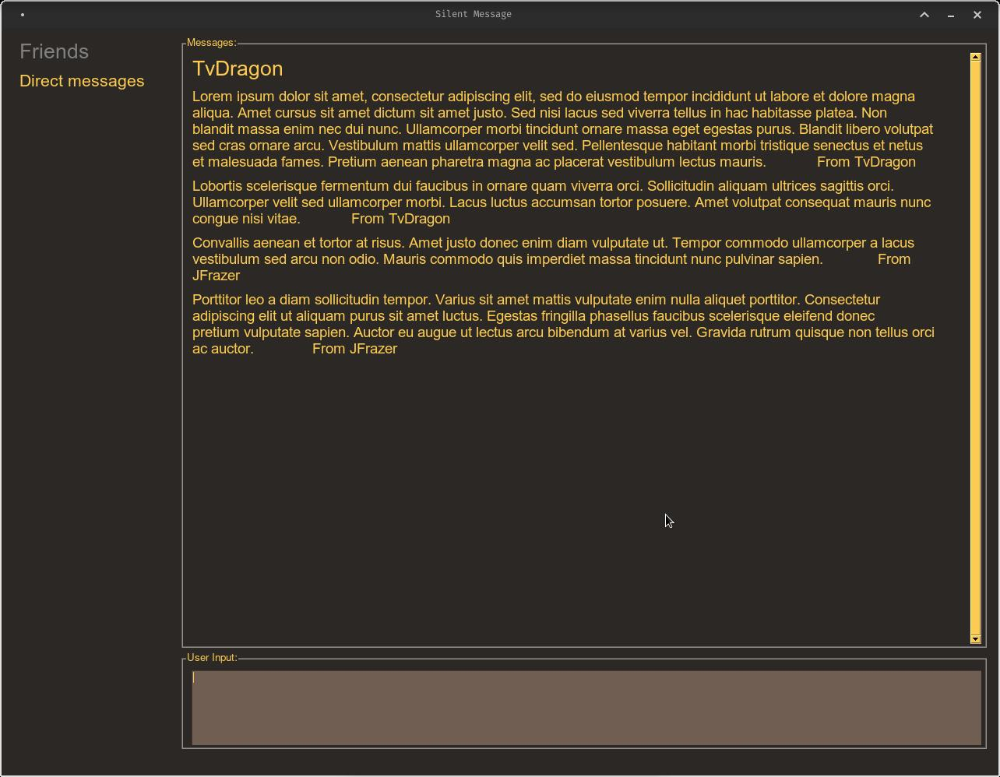
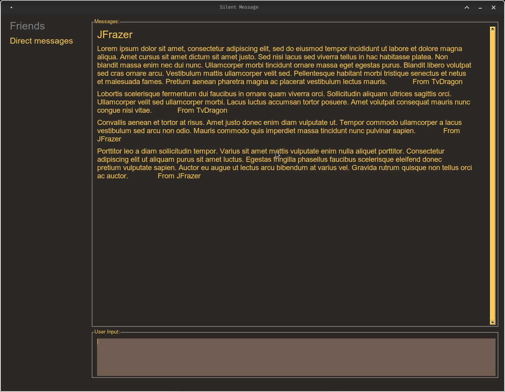

# Messaging Application

<!-- TABLE OF CONTENTS -->

  
Table of Contents

<ol>
  <li>
    <a href="#about-the-project">About The Project</a>
    <ul>
      <li><a href="#built-with">Built With</a></li>
    </ul>
  </li>
  <li>
    <a href="#getting-started">Getting Started</a>
    <ul>
      <li><a href="#prerequisites">Prerequisites</a></li>
      <li><a href="#installation">Installation</a></li>
    </ul>
  </li>
  <li><a href="#usage">Usage</a></li>
</ol>

<!-- ABOUT THE PROJECT -->
## About The Project

Originally, this was supposed to be an ecrypted messaging application where the messages would be encrypted before being send over the server however, I ran into issues trying to convert the encrypted messages into a string so I had to remove that from this project. Although, this is something that I'd like to work back on in the near future. This project is a messaging application on the desktop like other social messaging applications like skype and discord however, the messages would be stored on the users PC instead of on a server permanently. This was made as I wanted to learn how users were able to message someone over the internet using sockets and also used some knowledge on multithreading which I took a course in during university to create this application. It is noted that messages are stored temporarily on the server but the messages will be deleted once the receiver has logged on to retrieve those messages.

### Build With

* [![Python][python]][Python-url]

<!-- GETTING STARTED -->
## Getting Started

### Prerequisites

1. Install python if you don't already have it which you can follow from this [website](https://realpython.com/installing-python/).

2. Install the python virtual environment.

		pip install virtualenv

### Installation

1. Clone this repository to your desired location using git or download the zip file and extract it.

2. Open up your terminal or Command Prompt/Powershell and move into the directory that you cloned repository or downloaded the file to.

3. Enter the commands below into your teminal in that directory to create the virtual environment.

		python3 -m venv env

4. If you're using linux or Mac run the command below. Otherwise, skip to step 5.

		source env/bin/activate

5. If you're using Windows you'll need to run the following code below depending on whether you're using Command Prompt or Powershell. Otherwise, move onto the next step.

		env/Scripts/activate.bat	//In CMD
		env/Scripts/Activate.ps1	//In Powershell

6. You'll need to install the libraries needed to run the application by entering the commands below.

		pip install -r requirements.txt

This will install the libraries that will required which I've already listed inside the `requirements.txt` file.

<!-- USAGE EXAMPLES -->
## Usage

1. Once you have performed the installations. Open up two terminals and enter the command below to enter your virtual environment.

		source env/bin/activate

2. There will be a server and client version in their respective folders. The server version handles client connections and the client is the user. If you wish to run the server and/or client version move into the server and client folders and run the commands below respectively.

		python server.py
		python main.py

3. If you wish to deactive your virtual environment run the command below.

		deactivate

<!-- Example -->
## Screenshots of application

### 1) Sign Up

### 2) Sign In

### 3) Pending Friends List

### 4) Friends List

### 5) Messages

<!-- MARKDOWN LINKS & IMAGES -->
<!-- https://www.markdownguide.org/basic-syntax/#reference-style-links -->

[python]: https://img.shields.io/badge/Python-FFD43B?style=for-the-badge&logo=python&logoColor=blue
[Python-url]: https://www.python.org/